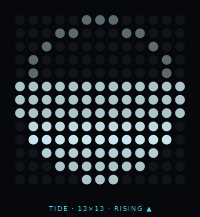

# Tide — Glyph Matrix Toy

A Glyph Matrix toy for the **Nothing Phone (4a) Pro** (`DEVICE_25111p`). A rising and falling
waterline tracking the tide, rendered on the 13×13 matrix. Always-on capable, never blank,
no flashing.

<p align="center"></p>

## What it does

- Fills the disk to the **true tide level** (dim water) — height shows how high the tide is.
- A soft **bloom band glides through the water in the tide's direction** — up toward the fill point while rising, down while ebbing — looping seamlessly (~6 s/pass, no strobe).
- A dim **limb ring** is always lit, so the disk is never blank — even at slack water.
- Redraws on the once-per-minute AOD tick, plus a slow 1 s sweep while actively viewed (drift animates only while actively rendering).

## Status

The tide **period** is real (principal lunar M2 = 12 h 25 m), calibrated to a NYC Harbor high tide.
The M2-only model drifts slowly and ignores spring/neap amplitude — recalibrate or wire NOAA per
station for true precision. See `REFERENCE_HIGH_TIDE_UTC_MILLIS` in
[`TideEngine.kt`](app/src/main/java/com/nothinglondon/sdkdemo/demos/tide/TideEngine.kt).

## Install

Download `app-debug.apk` from the [latest release](../../releases/latest) and sideload it.
Then enable the toy: **Settings → Glyph Interface → Flip to Glyph → Always-on Glyph Toy → Tide**.

## Preview without a device

Open [`preview.html`](preview.html) in a browser — it renders the exact `TideEngine` algorithm
on an on-screen 13×13 dot matrix, with sliders for time-of-day and spring/neap amplitude.

## Build

```
./gradlew :app:assembleDebug
```

Requires JDK 17 and Android SDK (compileSdk 35). Output: `app/build/outputs/apk/debug/app-debug.apk`.

## Credits

Built on Nothing's [Glyph Matrix Developer Kit](https://github.com/Nothing-Developer-Programme/GlyphMatrix-Developer-Kit)
and the [GlyphMatrix Example Project](https://github.com/KenFeng04/GlyphMatrix-Example-Project).
Bundles `glyph-matrix-sdk-2.0.aar` from the official kit.
